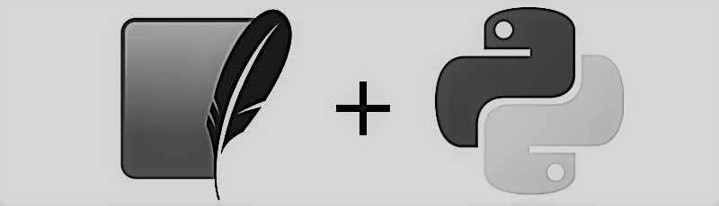

<h1> App Creada en Python</h1>

<h3> CRUD creado en Python con SQlite 3</h3>

>El archivo index es el archivo con la Clase Main, Se encarga de administrar la Base y la Parte visual de la APP.
Esta App es una Agenda Basica, se encarga de guardar los Datos de los Contactos Cargados

